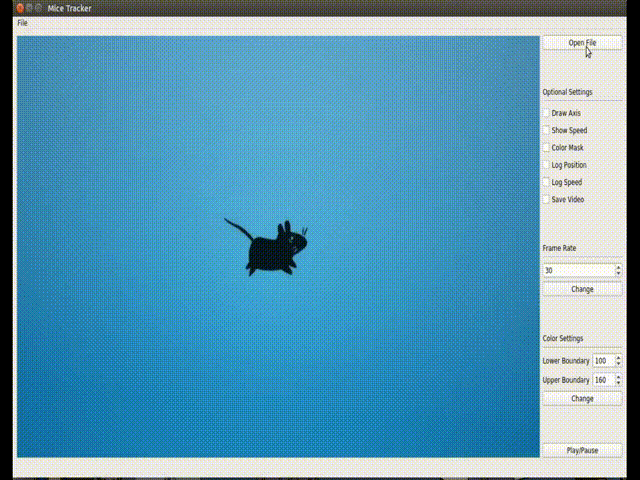
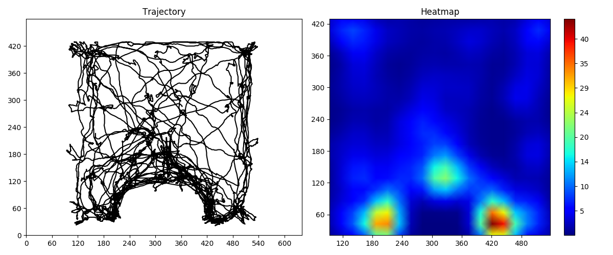

# Mice Tracking and Detection of Head Direction Using Principal Component Analysis (PCA)


This project **was developed and tested for Ubuntu and Windows**

To use the provided tools, the first step is to clone this repository, which can be can be accomplished by:

```console
user@computer:~$ git clone https://github.com/vanluwin/proj-pca.git
```

## Requirements

### Python enviroment

This section is a guide to the installations of a python environment with the requirements of this repository.

First, install [Anaconda](https://www.anaconda.com/distribution/) or [Miniconda](https://docs.conda.io/en/latest/miniconda.html), both of them give you similar results, but the latter requires less disk space.

Now, create a python virtual environment and install the required packages following the commands. Substitute **<environment_name>** with a name for your environment

#### On Linux Distributions

Open your terminal and execute the following commands:

```console
user@computer:~$ conda create -n <enviroment_name> anaconda python=3
user@computer:~$ conda activate <enviroment_name> || source activate <enviroment_name>
(<enviroment_name>) user@computer:~$ conda install -c loopbio -c conda-forge -c pkgw-forge ffmpeg gtk2 numpy==1.16.3 opencv==3.4.3 matplotlib scipy pyserial
```

#### On Windows

Open your anaconda command prompt and execute the following commands:  

```console
C:\Users\your-user> conda create -n <enviroment_name> anaconda python=3
C:\Users\your-user> conda activate <enviroment_name> || source activate <enviroment_name>
(<enviroment_name>) C:\Users\your-user> conda install -c loopbio -c conda-forge -c pkgw-forge ffmpeg numpy==1.16.3 opencv==3.4.3 matplotlib scipy pyserial
```

## Graphical User Interface

This GUI implements a more user-friendly way to interact with the tracking algorithm. Usage:

```console
(<enviroment_name>) user@computer:~/proj-pca/gui$ python main.py
```




## The scripts

To use the provided scripts, first make sure to activate your python environment:

### On Linux Distributions

On your terminal, execute the following command:

```console
user@computer:~$ conda activate <enviroment_name>
```

### On Windows

On your anaconda command prompt, execute the following command:  

```console
C:\Users\your-user> conda activate <enviroment_name>
```

### [PCA Analyser](./pcaAnalyser.py)


This script aims to track the mice and detect the head direction during behavioral neuroscience experiments. For testing, use the following suggested commands:

```console
(<enviroment_name>) user@computer:~/proj-pca$ python pcaAnalyser.py [-h] [--color-mask] [--both-axis] [--show-mask] [--save-video] video
```

**Required arguments**:

* *video*: Path to the video file to be processed.

**Optional arguments**:

* *-h*, *--help*: Show a help message and exit.
* *--color-mask*: Draw a colored mask over the detection.
* *--both-axis*: Draw both PCA axis.
* *--show-mask*: Displays a window with the segmented mask.
* *--save-video*: Create a video file with the analysis result.

### [Tracker](./tracker.py)


This script aims to track mice throughout a neuroscience experiment detecting when the mice are present in a previously selected region, with that the program is able to keep track of how many frames the animal stayed inside each zone. Usage:

```console
(<enviroment_name>) user@computer:~/proj-pca$ python tracker.py video frame_rate [--draw-axis] [--save-video] [--color-mask] [--log-position] [--log-speed]
```

**Required arguments**:

* *video*: Path to the video file to be processed.
* *frame rate*: Frame rate of the video file to be processed.

**Optional arguments**:

* *-h*, *--help*: Shows a help message and exit.
* *--draw-axis*: Draws both axis found through PCA. 
* *--color-mask*: Draws a colored mask over the detection.
* *--save-video*: Creates a video file with the analysis results.
* *--log-position*: Creates a log file with the (x, y) position coordinates of the tracked animal.
* *--log-speed*: Creates a log file with the speed of the tracked animal.

A statistics file containing the following information will be created.

```text
Counters for the regions considering 30fps video

Traveled distance: 16971.568 pixels
Region 0: 3995 frames, 133.167s
Region 1: 4105 frames, 136.833s
Region 2: 852 frames, 28.400s
Region 3: 727 frames, 24.233s
Region 4: 1378 frames, 45.933s
```

### [Tracker with Arduino integration](./trackerArduino.py)


This script is an integration of the tracking system with Arduino-based development boards, enabling experiments with real-time decisions like the control of a laser simulated by the blue led in the gif above.

To utilize the script first, upload the [Arduino file](./trackerArduinoFile.ino) to your microcontroller and make sure that the serial communication is working. Then, in your terminal, run the following command:

```console
(<enviroment_name>) user@computer:~/proj-pca$ python trackerArduino.py [-h] [--draw-axis] [--save-video] [--color-mask] [--log-position] video
```

**Required arguments**:

* *video*: Path to the video file to be processed.

**Optional arguments**:

* *-h*, *--help*: Show a help message and exit.
* *--draw-axis*: Draw both PCA axis.
* *--color-mask*: Draw a colored mask over the detection.
* *--save-video*: Create a video file with the analysis results.
* *--log-position*: Creates a text file with the (x, y) position of the tracked mice.

### [Detections Analyser](./detectionsAnalyser.py)


This script is intended to manually correct errors in detections that have already been made and can be edited, a window containing the instructions will be displayed. Pause and press *d* to edit the detections of the current frame. Usage:

```console
(<enviroment_name>) user@computer:~/proj-pca$ python detectionsAnalyser.py video log_file
```

Avalible commands:

* *space* - Pause the video stream
* *q*, *esc* - Finish the execution
* *s* - Increases the delay between each video frame
* *f* - Decreases the delay between each video frame
* *d* - Opens a new window where the user is able to select a new point by drawing a rectangle with the disered point in its cente, to finish the selection press *enter*, press *c* to clean the selection.

### [Heatmap Plot](./heatmapPlot.py)



This scripts takes as input a detection log file produced by the *tracker.py* script used with the *--log-position* option, and produces a heatmap plot, a window containg the plot will be displayed. Usage:

```console
(<enviroment_name>) user@computer:~/proj-pca$ python heatmapPlot.py log_file frameWidth frameHeight
```

**Required arguments**:

* *log_file*: Path to the log file file to be processed.
* *frameWidth*: Frame width of the processed video.
* *frameHeight*: Frame height of the processed video.

### [Speed Plot](./speedPlot.py)


This scripts takes as input a speed log file produced by the *tracker.py* script used with the *--log-speed* option, and produces a speed plot, a window containg the plot will be displayed. Usage:

```console
(<enviroment_name>) user@computer:~/proj-pca$ python speedPlot.py log_file
```

**Required arguments**:

* *log_file*: Path to the log file file to be processed.

<!-- ## Any questions?

Feel free to contact me at richardsonsantiago@ufrn.edu.br -->
