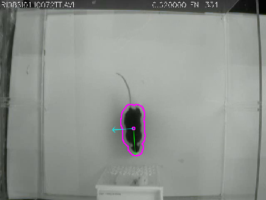

# Mice Tracking and Head Direction Using Principal Component Analysis (PCA) 



This project **was developed and tested for Ubuntu 16.04 and 18.04.**

## Requirements

This section is a guide to the installations of a python environment with the requirements of this repository.

First, install [Anaconda](https://www.anaconda.com/distribution/) or [Miniconda](https://docs.conda.io/en/latest/miniconda.html), both of them give you similar results, but the latter requires less disk space.

Now, create a python virtual environment and install the required packages following the commands. Substitute **<environment_name>** with a name for your environment

```console
user@computer:~$ conda create -n <enviroment_name> anaconda python=3
user@computer:~$ conda activate <enviroment_name>
(<enviroment_name>) user@computer:~$ conda install -c loopbio -c conda-forge -c pkgw-forge ffmpeg gtk2 opencv numpy
```

## Using the scripts

To use the provided scripts, make sure to activate your python environment, that can be accomplished by:

```console
user@computer:~$ conda activate <enviroment_name>
```

### [PCA Analyser](./pcaAnalyser.py)

This script aims to track the mice and detect the head direction during behavioral neuroscience experiments. For testing, use the following suggested commands:

```console
(<enviroment_name>) user@computer:~/proj-pca$ python pcaAnalyser.py [-h] [--color-mask] [--both-axis] [--show-mask] [--save-video] video bg_image
```

Optional arguments:

* *-h*, *--help*: Show a help message and exit.
* *--color-mask*: Draw a colored mask over the detection.
* *--both-axis*: Draw both PCA axis.
* *--show-mask*: Displays a window with the segmented mask.
* *--save-video*: Create a video file with the analysis result.

Positional arguments:

* *video*: Path to the video file to be processed.
* *bg_image*: Path to the background image without the animal in the scene.


### [Tracker](./tracker.py)

This script aims to track mice throughout a neuroscience experiment detecting when the mice is present in a previously selected region. Usage:

```console
(<enviroment_name>) user@computer:~/proj-pca$ python tracker.py [-h] [--draw-axis] [--save-video] [--color-mask] video bg_image
```

Optional arguments:

* *-h*, *--help*: Show a help message and exit.
* *--draw-axis*: Draw both PCA axis.
* *--color-mask*: Draw a colored mask over the detection.
* *--save-video*: Create a video file with the analysis results.

Positional arguments:

* *video*: Path to the video file to be processed.
* *bg_image*: Path to the background image without the animal in the scene.


### [Detections Analyser](./detectionsAnalyser.py)

This script aims to analyze detections previously made and edit them if necessary, a window contaning the dectctions will be displayed. Pause and press *d* to edit the detections of the current frame. Usage:

```console
(<enviroment_name>) user@computer:~/proj-pca$ python detectionsAnalyser.py video log_file
```

Avalible commands:

* *space* - Pause the video stream
* *q*, *esc* - Finish the execution
* *s* - Increases the delay between each video frame
* *f* - Decreases the delay between each video frame
* *d* - Opens a new window where the user is able to select a new point by drawing a rectangle with the disered point in its cente, to finish the selection press *enter*, press *c* to clean the selection.


### [Heatmap Plot](./heatmapPlot.py)

This scripts takes as input a detection log file and procuces a heatmap plot, a window containg the plot will be displayed. Usage:

```console
(<enviroment_name>) user@computer:~/proj-pca$ python heatmapPlot.py log_file
```


